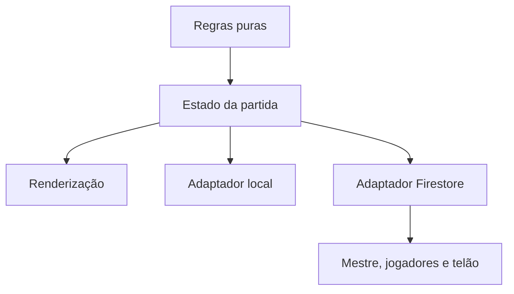

# Auditoria do Mosaico Card

Atualizada em 11 de setembro de 2026.

## Síntese

O projeto já possui identidade consistente: petróleo, cartas marfim com profundidade, controles físicos, moeda como recompensa visual e separação entre monte coletivo e pistas particulares. O fluxo por código/QR e o console inferior formam uma boa base para testes com grupos.

A prioridade seguinte não é acrescentar efeitos, mas tornar o estado multiplayer autoritativo e previsível antes de ampliar casos ou pontuação.

## Pontos fortes

- Hierarquia entre ambiente, cartas, áreas coletivas e particulares.
- Quatro ações com cores próprias e um padrão único de seleção.
- Console inferior compacto e sempre disponível no celular.
- Monte em leque com compra direta por toque.
- Feedback pela moeda, rastro e carta especial.
- Identificação sem conta Google e QR gerado localmente.
- Alvos de toque preservados em 44 px.

## Riscos de jogabilidade

### P0 — antes de uma partida real avaliativa

1. **Saldo compartilhado como valor único.** O snapshot transmite `moedas` como um número, embora cada jogador deva administrar seu saldo. Uma ação publicada por outro aparelho pode substituir o valor local.
2. **Respostas travadas como estado único.** `travados` é global, mas a regra diz que uma resposta errada fecha o campo “para você”. É necessário decidir se o julgamento é individual ou coletivo.
3. **Cronômetro sem prazo autoritativo.** O snapshot não grava o horário final do turno; aparelhos podem exibir tempos diferentes.
4. **Concorrência de ações.** A publicação atualiza diretamente o documento. Ações quase simultâneas podem se sobrescrever; devem ser validadas por transação e identificador do turno.

### P1 — clareza das regras

5. **Ovelha previsível.** A primeira ovelha ocupa a posição inicial do array, mas o monte permite escolher qualquer carta. É preciso optar entre sorteio real e primeira compra garantida.
6. **Fim do cronômetro.** Ao chegar a zero, o relógio para, mas a vez não muda automaticamente. Definir encerramento automático, tolerância do Mestre ou confirmação.
7. **Balaio pouco visível.** Falta uma presença coletiva permanente mostrando quantidade, itens e pagamentos.
8. **Fechamento limitado.** O final ainda não compara evidências, interpretações e decisões dos participantes.

## Riscos técnicos

- `game-sala.js`, `game-ovelha6.js` e `game-fix.js` sobrescrevem funções do motor em cascata.
- A ordem dos scripts funciona como dependência implícita.
- Estado e renderização dependem de variáveis globais.
- Os testes são principalmente estruturais e não simulam dois clientes concorrentes.
- As regras de produção do Firestore devem ser auditadas contra `salas/{codigo}`.

## Refatoração recomendada

1. Criar `game-core.js` com ações puras.
2. Modelar `saldosPorJogador`, `travadosPorJogador`, `maosPorJogador` e `turnoId`.
3. Separar adaptadores local e Firestore; somente transação válida muda o turno.
4. Gravar `turnoTerminaEm` com timestamp do servidor.
5. Converter a ovelha em regra declarativa, sem sobrescrever funções.
6. Absorver `game-fix.js` no núcleo e removê-lo.

## Recomendações estéticas

1. Preservar o petróleo claro e as cartas marfim: é a assinatura mais forte.
2. Manter vermelho para seleção e urgência com intensidades distintas: contorno estável no botão e pulsação apenas no cronômetro.
3. Dar ao balaio uma pequena área coletiva no vocabulário visual do monte.
4. Mostrar instruções contextuais curtas no console para evitar painéis altos.
5. Testar em 320–430 px e com texto do iOS em 125% e 150%.

## Sequência sugerida

| Ordem | Entrega | Motivo |
| ---: | --- | --- |
| 1 | Estado individual por jogador | Evita saldo e respostas incorretos. |
| 2 | Turno e cronômetro autoritativos | Garante a mesma partida em todos os aparelhos. |
| 3 | Transações e regras do Firestore | Evita ações simultâneas e sobrescritas. |
| 4 | Núcleo único de regras | Elimina a cascata de sobrescritas. |
| 5 | Balaio e fechamento comparativo | Melhora compreensão e valor pedagógico. |
| 6 | Testes com vários clientes | Valida o fluxo real antes de ampliar casos. |

## About sugerido para o GitHub

**Descrição:** Jogo digital de cartas, pistas e decisões do projeto MOSAICO — fatos parciais, interpretações e mesa multiplayer.

**Website:** https://drmarionascimento.github.io/Mosaico-Card/

**Topics:** `mosaico`, `card-game`, `multiplayer`, `firebase`, `firestore`, `javascript`, `mobile-first`, `serious-game`, `educational-game`.
